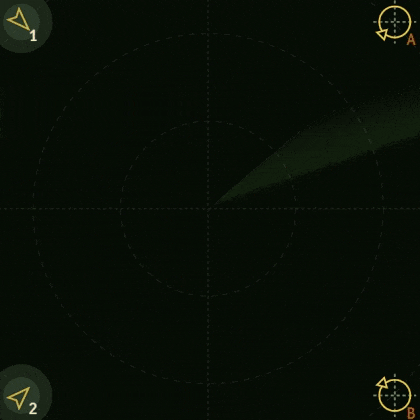

# Instructions

You can find example implementations in different languages in this repository. 

They are only examples, you can also do your own solution from the ground up!

## Overview



The goal of the game is to steer airplanes and land them into airports.
In order to land an airplane to an airport:
- Distance from airplane to airport needs to be `10` or less
- Their directions must match exactly

The aircraft have a limited turning radius. They change their direction by at most `20 degrees` per tick.

Each aircraft has a `collisionRadius` property. The game ends if any collide.

## Game state

You receive the game state with websockets by subscribing to it.
It contains all the necessary information to steer the planes.

The websocket message payload has a `gameState` key, which contains the current state of the game as a stringified JSON. It contains the bounding box of the playing area, a list of aircraft, and a list of airports.


## Commands

You send commands with the websocket to update the state.
The message is in format (requires stringification before sending):
```json
[
  "run-command", 
  { 
    "gameId": "{game_id}", 
    "payload": [
      "HEAD {aircraft_id} {direction}",
      "HEAD {aircraft_id} {direction}"
    ]
  }
]
```

All directions are based on the unit circle in degrees, 0 being right and increasing counter clockwise. E.g. 0 is right, 90 is up, 180 is left, and 270 is down. It must be a whole number in range [0, 359].

One payload can contain multiple commands to control multiple aircraft simultaneously.

## Score

Your score increases by 1 when:
- the game advances by one tick
- a command is received

For example:
- sending a `run-command` packet with an empty payload will increase the score by 1, because each `run-command` packet advances the game by 1 tick. 
- Sending a `run-command` with two commands in the payload will increase the score by 3 (1 for the tick and 2 for the commands).

Lowest score wins.

## Levels and Games

The whole system consists of levels and game instances.

Level is a static representation of a initial game state and you can play specific level by creating a game instance from the levels initial game state.

Each game instance is associated with an owner, and only they can make edits. Viewing a game is possible as long as you know the game's entity id.

## Web Socket Message Type Definitions

All the websocket messages are JSON objects in the format of:

```json
["action-name", {...}]
```

Where the payload depends on the action.

List of available WebSockets actions and their respective payloads:

```ts
type Messages = {
  "sub-game": { // Subscribes the WebSocket to the game with the given id
    id: string
  }
  "game-instance": { // Updated game instance. Only sent from the server
    entityId: string
    gameState: string
    ownerId: string
    status: string
    reason: string
    createdAt: Date
    gameType: string
    score: number
    levelId: string
  }
  "run-command": { // Send commands for the game engine. Payload depends on the game type
    gameId: string
    payload: unknown
  }
  "success": { // General purpose success message
    message: string
  }
  "failure":  { // General purpose failure message
    reason: "Forbidden" | "Internal Server Error" | "Bad Request" | "Rate Limit"
    desc?: string
  }
}
```

**ALWAYS REMEMBER TO STRINGIFY THE PAYLOADS BEFORE SENDING THEM!** \
The websocket only accepts string data!


